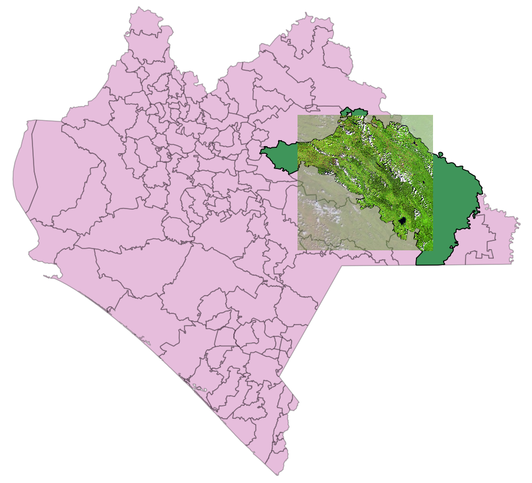

Clip raster with polygons (english / español)
==============================

# English

Clips/crops a raster file using a shapefile composed of several features.

Adapted from the script showed by OpenSourceOptions in Youtube:
https://youtu.be/K8eRbeBrHHk
opensourceoptions.com

The featured example uses a raster file and a shapefile with the municipalities of the state of Chiapas, Mexico https://map.ceieg.chiapas.gob.mx/geoweb/

## Getting started

1. Put the inputs (raster file and folder of the shp file) in the repo.
2. Change the env variables within the env file according to the inputs names.
3. Run the following commands in the command line (conda requiered):
```
conda env create -f environment.yml
conda activate clip_raster_with_polygons
python execution_clip_raster.py
```
4. A new folder with the clipped files will be generated.


# Español

Corta un archivo raster a partir de un shapefile compuesto por varios polígonos.

Adaptación del script mostrado por OpenSourceOptions en Youtube:
https://youtu.be/K8eRbeBrHHk
opensourceoptions.com

El ejemplo empleado ocupa un archivo raster y un shapefile de los municipios del estado de Chiapas, Máxico https://map.ceieg.chiapas.gob.mx/geoweb/

## Instrucciones de uso

1. Uibcar los insumos (archivo raster y carepta del archivo shp) dentro del repositorio.
2. Adaptar las variables de enotrno en el archivo env de acuerdo a los insumos.
3. Ejecutar los siguientes comandos en la terminal (se requiere conda):
```
conda env create -f environment.yml
conda activate clip_raster_with_polygons
python execution_clip_raster.py
```
4. Se generará una carpeta adicional con los archivos recortados.
